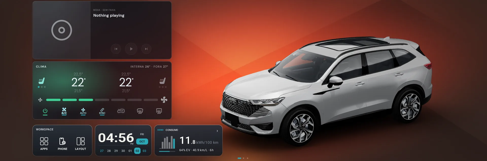
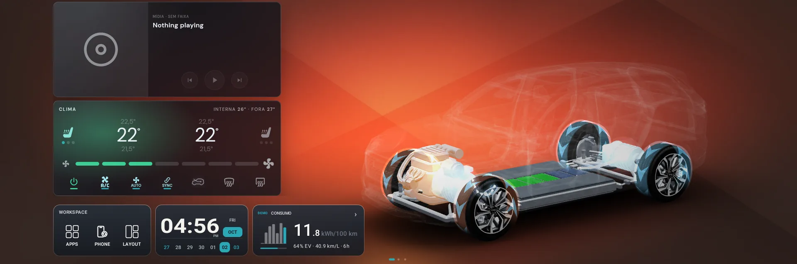
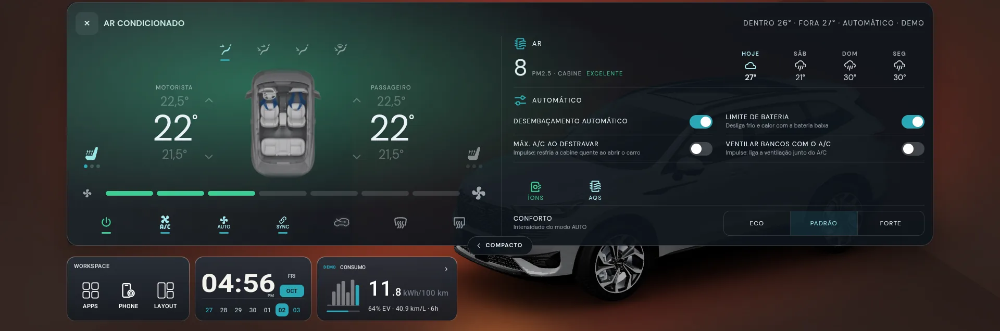
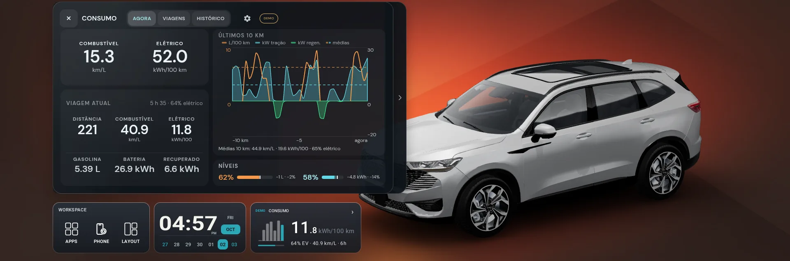

# Impulse Home



A live 3D home screen for the **Haval H6** head unit (Snapdragon SA8155, 1920x720
panel, Android 9 WebView). It draws your car, its doors, lights and wheels, and puts
climate, energy, trips and driving controls next to it, all fed in real time from
the vehicle bus.

It is part of the [Impulse](https://github.com/bobaoapae/haval-app-tool-multimidia)
ecosystem: Impulse reads and writes the vehicle bus, Impulse Home draws it.

> Not affiliated with or endorsed by GWM / Haval. Credits and trademarks:
> [THIRD_PARTY.md](THIRD_PARTY.md). The screenshots below come from an emulator with
> simulated data (the app marks it **DEMO**).

## What it does

### Your car, in 3D

* The HEV, PHEV and GT bodies, with doors, lights and wheels that follow the car.
* Wheels turn with a motion-blur sprite tuned to the panel's frame rate, and a catalogue
  of more than twenty rims to try on.
* Paint colour, window tint and ride height; day and night lighting.
* **X-ray view:** the body turns into a ghost and the drivetrain shows through, with
  energy flowing to the wheels.



### A board of widgets

One 6x2 grid beside the car, arranged in the **Layout manager**. The car takes the
columns the widgets leave free. Eleven widget types, in sizes from 1x1 to 3x2: media,
climate, consumption, range, power flow, energy graphs, driving, vehicle status, clock,
turn-by-turn navigation and a vehicle/theme profile. Dark and light themes.

Tap a widget to open it as a larger **popup**.

### Climate

Dual-zone temperature, fan speed, seat heating and ventilation, AUTO, A/C, SYNC and
defrost, plus cabin air quality, a four-day weather forecast and comfort intensity. With
Impulse installed, Impulse Home can show its own panel when you press the car's climate
controls, instead of the stock one.



### Energy and trips

* **Range:** battery and fuel range side by side, with a forecast checked against what
  the battery really did on each charge cycle.
* **Power flow:** a top-down drivetrain with live power, battery level and the last 60 s.
* **Consumption:** now, per trip and history, with a map and the altitude for each
  trip, recorded on the head unit.



### Driving and the rest

Drive mode, energy mode, regeneration, steering feel, one-pedal and ESP from one popup;
now-playing media; a workspace for apps and phone projection (Android Auto and CarPlay);
a clock; wallpaper presets.

## Built for a slow main thread

The head unit's WebView is the constraint, not the GPU, so the viewer renders on demand and
keeps vehicle-bus signals away from React. The [engineering notes](docs/engineering/measuring-and-performance.md)
record every number it is built on, measured on the car, including the ones that proved earlier
assumptions wrong.

## Install

**Prerequisite:** [Impulse](https://github.com/bobaoapae/haval-app-tool-multimidia) must be installed on the head unit. Impulse Home gets its vehicle data from it, so install Impulse first.

**From Impulse (recommended).** Open Impulse -> *Instalar Apps* -> **Impulse Home**. Impulse
downloads the latest signed release and offers to set it up.

**By hand.** Download `impulse-home.apk` from the [Releases](../../releases) page, then:

```bash
adb push impulse-home.apk /data/local/tmp/viewer.apk
adb shell pm install -r -i com.autolink.installer /data/local/tmp/viewer.apk
```

`adb install` stalls on this unit, and the `-i com.autolink.installer` identity is
required: the head unit refuses a plain install of this package.

Releases are signed with one key; see [SECURITY.md](SECURITY.md) to verify it.

## Repository layout

| Path | What |
|---|---|
| `index.html`, `support.js` | the viewer (React + three.js, no bundler) |
| `app/` | Android shell: WebView host, vehicle-bus bridges, trip recorder |
| `vendor/` | vendored runtime libraries |
| `scripts/` | build tooling for models and textures, device harnesses, tests |
| `assets/` | fetched, not tracked (see `assets.lock.json`) |
| `docs/` | engineering notes measured on the car, architecture, feature contracts, vehicle data ([index](docs/README.md)) |
| `AGENTS.md` | guide and ground rules for AI agents working in the repository |

## Licenses and credits

* **Code:** [AGPL-3.0](LICENSE).
* **Assets** (3D models, images, video): [LICENSE-ASSETS](LICENSE-ASSETS). They are not open
  source; official builds may be used, the files may not be reused.
* **Third-party:** [THIRD_PARTY.md](THIRD_PARTY.md).
* Weather data by [Open-Meteo.com](https://open-meteo.com/) (CC BY 4.0). Seat icon: "heated
  seat" by Thuy Nguyen from the Noun Project. Icons: Material Design Icons (Apache-2.0).
